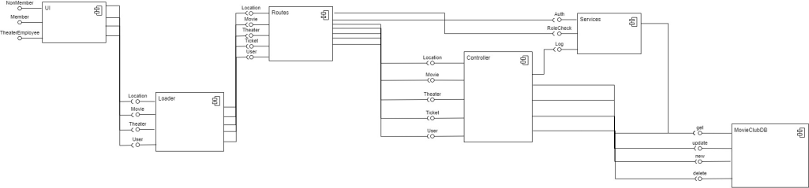
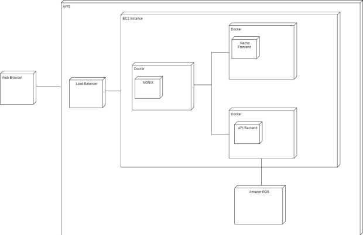

# Team Name

Team Nacho

# Tech Stack 

Frontend: Angular

Backend: ExpressJS

Deployment: Nginx, Docker, AWS loadbalancer ,Auto Scaling Group, EC2

# How to run the Web App

1. `cd ui-components`

2. `npm install`

3. `npm run start`

# How to run service

1. `cd services/movies`

2. `npm install`

3. `npm run dev`

# How to run web app and services with docker

1. Install docker locally

2. Run command `docker-compose up -d`

# Team Members

Abhinandu Reddy Kondakrindi(Developer) 016592654

Varun Papishetty(Developer)
016980821

Prakhya Maylavaram (Scrum Master) (Developer)
016522883

Martin Alvarez Lopez(Developer)
016420430

# System Architecture

# Component Diagram

# Deployment Diagram

# Project Journal

[Project Journal](https://docs.google.com/document/d/14nfI9v74NWMrqhsyJKMe3u6dMij9h_6o6KU2-QApByI/edit)

# Sprint Sheet

[Sprint Sheet](https://docs.google.com/spreadsheets/d/1m4Ibe-rhXuVgoV_x3BgC4FgF6b--0I5SgRsz_HJX17s/edit#gid=1740786216)

# Wireframes

[Wireframes](https://docs.google.com/presentation/d/1KlhUpyJK3Jup_AVr1WPqaLM6MHsBawxuHMp1oe-cS8k/edit#slide=id.p1)

# XP Core values Followed by Team

Communication: In a team, effective communication is crucial for the success of any project. We followed this value by maintaining open lines of communication throughout the project lifecycle. This involves regular stand-up meetings, transparent sharing of progress and challenges, and using collaborative tools like Git to keep everyone on the same page. In XP, communication isn't just about talking; it's about ensuring that everyone understands their roles, the current state of the project, and the next steps. Pair programming was utilized in our project to improve communication and ensure that everyone could understand the codebase.
Feedback: Feedback is another key XP value that our team has followed. This involves constantly seeking feedback on the work from team members. We conducted code reviews to ensure quality, as well as iterative development where we built and share small parts of the project with each other . This approach helped in early detection and fixing of issues, adapting to requirements, and ensuring that the final product aligns well with the requirements. We have adopted test-driven development (TDD) practices to get immediate feedback on the code being written.

